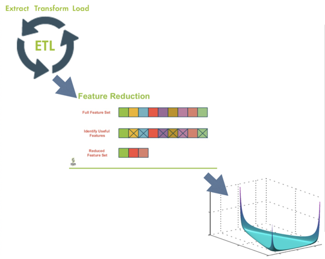

 # Enron Email Analysis

## Overview

This repository contains the classes to create a pipeline that creates and saves NLP models as well as the tools to use that model to analyze your corpus. The goal of the pipeline is to streamline the standard steps that are required when generating a model. 

As of right now, the pipeline is equipped to generate LDA Models. 

Latent Dirichlet Allocation (LDA) is a model that analyzes unobserved groups and is able to group them based off of their "hidden" topics. 


## NLP Primer

<b> NLP</b>: Natural Language Processing

<b> Token</b>: An individual unit of text (string format)

<b> Document</b>: A single text

<b> Corpus</b>: Collection ('body') of documents being analyzed

<b> Stop Words</b>: Common words that don't contribute to document meaning. 

<b> Bag of Words</b>: Simplifying representation that omits grammar and word order and tracks word occurrence. 

## Pipeline Process



In the visual, three different steps are shown: 
* Extract, Transform, Load
* Feature Reduction
* Generating Model

In the Extract, Transform, Load (ETL) step, you are preparing the data to be cleaned. This step is done in the store_data.py file. 

In the Feature Reduction step, you are removing the noisy elements or elements that make it harder to interpret your data. This step is done using the text_pipeline package. 

In the Generating Model step, you generate the LDA Model using LDA.py. 

## Using Your Model

### Document Topic Vectors

After generating your model, you need to generate the document topic vectors. These vectors can be used for finding similar documents or for doing semantic searches (amongst other things). 

```
document_corpus_value = corpus[document_counter]
document_topic_vector = lda.get_document_topics(document_corpus_value)
```

The above code snippet shows how to generate a document topic vector. First, you must get the bag of words (BoW) representation of the document. From the definition above, we know that the BoW representation of a document is a list of tuples that tracks the index of each word as well as the frequency that it occurs. 

Below is the format of a BoW representation of a document. 


Now that we have our BoW representation of the document ready, we will call the get_document_topics method on the ldamodel and pass in our BoW as the parameter. 
This will return the document's topic vector. 

### Nearest Neighbors Search

Nearest Neighbors Search is defined as the process of finding points from a given set that are most similar to your starting point. 


Looking at the image above, you can identify the starting point as the center data point and the 5 nearest neighbors as the data points closest to the starting point. This is a simple illustration of how nearest neighbors works. When doing a nearest neighbors search with your corpus, instead of comparing 2D points like in the image, you'll be comparing N-D points, where N is the number of topics you set your LDA Model to find.

This code uses NMSLib when conducting its nearest neighbors searches. NMSLib stands for Non-Metric Space Library. 

```
index = nms.init(method = 'hnsw', space = 'cosinesimil')
for vector in self.emailCol.find9 {'$query': {}, '$orderby': {'email_counter': 1} } ):
	index.addDataPoint(vector['email_counter'], vector['topic_vector'])
index.createIndex()
```

To create the index you must pass in the method and space. They are set to 'hens' and 'cosinesimil' respectively. These parameters have been optimized for nearest neighbors	searches and are quite good for text analysis. 

After calling .init, you must add all the data points to the index. In this case, each data point is a document topic vector. 

To conduct a nearest neighbors search, you must query the index created using NMSLib with the starting email's document topic vector. This would return a list of IDs of emails that have the closes document topic vectors to the starting document's topic vector. 


### Semantic Search

Semantic Search is useful in how it returns documents that may not contain the actual word you search for, but are heavily related to the topic of the search word. 

The way semantic search works is, first, the user must input some search words. The model will then treat those words as a new document and will generate a topic vector for it. The process for generating a topic vector is the same as stated in the Document Topic Vector section of the ReadMe where you must first generate the BoW representation of the document and then feed that into the get_document_topics method that the lda model calls. Then query the index by this new topic vector, and this will yield IDs of documents that are most similar to the topic vector of the search words. 

## Data_Acquisition_and_Understanding

### Pipeline.py

<pre>
<i> class </i> Pipeline(<i>*steps</i>)
</pre>

##### Class Parameters:
* steps: List of objects to be applied to the data. Variable length of list. 

#### apply(self, result)
Calls the next step in the pipeline. 


## store_data.py 

This file reads the data from the CSV files and puts it into Mongo DB. The unique ID used (_id) will be the unique ID each email has. 

```
store_csv_files = EmailDataStorage('../../../Enron/Data')
store_csv_files.move_data()
```

##### Class Parameters: 
* :param {str} filepath:
	Filepath to the current set of data being added to the database

#### move_data(self)
This method will navigate to the folder where the CSV files are stored and will read them. As it reads a row (and that row meets the necessary requirements), the row will be passed to the add_data method to be added to the database. 

This method has no parameters. 

#### add_data(self, row)
Here the row is being added to the database. The fields that we require we pull from row and store. A few fields require cleaning, so the cleaned versions of those fields are returned from method calls such as clean_emails and clean_content. 

##### Parameters:
* :param {tuple} row: Tuple of values that contain the information about a specific email. 

The snippet of code below shows the fields in the database. 
```
email_data = {
            '_id': row[1].lstrip('<').rstrip('>'), # this is the message id
            'date': row[2],
            'sender': row[6],
            'sender_email': self.clean_emails(row, True),
            'recipient': row[7], 
            'recipient_email': self.clean_emails(row, False), 
            'subject': row[5], 
            'cc': row[8], 
            'bcc': row[9], 
            'content': self.clean_content(row[13]),
            'email_counter': eval(row[0]), 
        }
```

#### clean_emails(self, row, sender_recip)
This method cleans the sender and recipient fields in row. Different values are required depending on whether or not we are currently cleaning a sender email or a recipient email. 

##### Parameters: 
* :param {tuple} row: Tuple of values that contain the information about a specific email. 
* :param {boolean} sender_recip: Indicates whether or not this is the sender's email or recipient's email

#### clean_content(self, unfiltered_content)
This method removes repeated sets of characters that add no meaning to the message. Remember, these changes are occurring in the original version of the email. That way if the user wants to see the original content (before the processing) they can see a clean version that doesn't have all those useless characters. 

##### Parameters:
* :param {str} unfiltered_content: Content of one (singular) email


## LDA.py 

This class will use a dictionary and corpus to generate a LDA Model that will be used for future analysis. 

If create_texts is true, then at the end of the process there will be saved versions of the texts, corpus, dictionary, lda model, and pyLDAvis model. These can (and will) be used later. 

Otherwise (if create_texts is false), there will just be a new lda model and a new pyLDAvis model. The texts, corpus, and dictionary files will be unaffected (since we are just reading from them and not changing them).

##### Class Parameters:
* :param {boolean} create_texts: Whether or not we must create texts or simply load them from a file. 
* :param {str} texts_filepath: Either the location of where to load texts from or where we must save texts to. 
* :param {str} corpus_filepath: Location of where we must save or load the corpus from. 
* :param {str} dictionary_filepath: Location of where we must save or land the dictionary from. 

#### start_cleaning_process(self, texts_filepath, corpus_filepath, dictionary_filepath)
This method starts the process of processing the emails. The processed content from each email is added to a list so that at the end we have a list of list of tokens. The processing occurs in the clean_data method that is called from this method. After all the contents are appended, we do frequency checks. Finally, we save the final version of texts so that we can later load it instead of having to process it every time. 

##### Parameters:
* :param {str} texts_filepath: Where to save the generated texts to. 
* :param {str} corpus_filepath: Where to save the generated corpus to. 
* :param {str} dictionary_filepath: Where to save generated dictionary to. 

#### clean_data(self, table, text)
Removes characters that aren't letters or numbers as well as excludes stopwords and words that have a length of 1.

##### Parameters: 
* :param {str} text: container that has one email 
* :param table: structure that maps the characters in self.remove to blank spaces 

#### frequency_check(self, corpus_filepath, dictionary_filepath)
Removes tokens that only occur once in the entire corpus. 

##### Parameters: 
* :param {str} corpus_filepath: Where to save the generated corpus to. 
* :param {str} dictionary_filepath: Where to save generated dictionary to. 

#### email_database_content(self)
Here we group the tokens in one document back together that way we can see the filtered document as one long string instead of a list of tokens. 

No parameters. 

#### save_texts(self, filepath)
Save the list of list of tokens that way we don't need to recompute them in the future. 

##### Parameters: 
* :param {str} filepath: Filepath of where to save information. 

#### load_texts(self, filepath)
Load texts (list of list of tokens) from the file it was saved to earlier. 

##### Parameters: 
* :param {str} filepath: Filepath of where to load information from. 

#### load_dictionary(self, dictionary_location)
Load the dictionary from the file it was saved to earlier. 

##### Parameters: 
* :param {str} dictionary_location: Filepath of where to load information from. 

#### load_corpus(self, corpus_location)
Load the corpus from the file it was saved to earlier. 

##### Parameters: 
* :param {str} corpus_location: Filepath of where to load information from. 

#### set_dict_corp(self, corpus_location, dictionary_location)
Update the dictionary with the new documents, generate the corpus with the new dictionary and save both. 

##### Parameters: 
* :param {str} dictionary_location: Filepath of where to load information from. 
* :param {str} corpus_location: Filepath of where to load information from. 

#### make_corpus(self)
Make the corpus from the dictionary. 

No parameters. 

#### get_domain(self, list_filtered_emails, email)
Find the domain of the sender and recipient emails. 

##### Parameters: 
* :param {str} list_filtered_emails: List of filtered emails. 
* :param {line in database} email: One line in the database

#### set_email_database(self)
Add the filtered content and corpus for each email to their row in the database.

No parameters.

#### fit_LDA(self, lda_filepath, pyldavis_filepath, num_topics)
Generate / fit the LDA model. Both the model generated and a pyLDAvis representation of the model will be saved. Both can (and will) be used for future analysis. 

##### Parameters:
* :param {str} lda_filepath: Where to save lda model to. 
* :param {str} pyldavis_filepath: Where to save pyldavis model to. 
* :param {int} num_topics: Number of topics the LDA model should look for. 

#### get_run_param(self)
Gather the run parameters that will be used when creating the LDA model. 

No parameters. 


3. docTopicVector.py in the Data_Aquisition... folder. 

Parameters: 

:param {str} lda_model_location:
    Filepath to the LDAModel

End result: The topic vectors for each document will be stored in a separate database. One thing to note is that the _id in this database will also be the unique ID found in the CSV files. So the _id is the same in the emails and topic vectors database. This will be important as we will use this feature when trying to access both sets of information. 

4. similarDoc.py in the Data_Aquisition... folder. 

Parameters: 

:param {str} index_filepath: 
	Location of where to load or save index from/to. 
            
:param {bool} create_index:
	Determines whether or not a new index has to be made

End result: This file finds the nearest neighbors to a particular document or topic vector. We will use this in the future when conducting semantic searches (searches related to the topic vectors of a document and the words being searched). 

5. searchFeatures.py in the Data_Aquisition... folder. 

Parameters: 

:param {boolean} keyword: 
	True if user wants to do a keyword search for the exact word in the text. 
            
:param {boolean} topic_search:
	True if user wants to do a topic search for the exact word in the text
            
:param {varies} *words:
	Words that the user wants to search by. 
            
:param {int} num:
	Number of documents the user wants returned
            
:param {str} dict_filepath: 
	Where to load dictionary from
        
:param {str} lda_filepath: 
	Where to load LDA Model from
        
:param {str} index_filepath: 
	Where to load/save index to. 
        
:param {str} create_index:
	Whether or not we need to create a new index. 

End result: If keyword (bool) is true, then num (int) number of documents that contain the words passed in will be returned. 
If topic_search is true, the num (int) number of documents that are similar to the topic vector of the words will be returned. 
